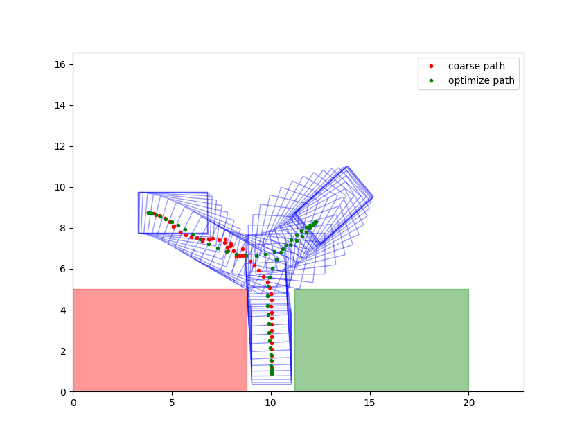
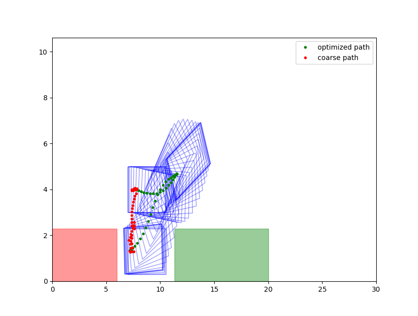

# PY_OBCA

pyobca is a python implement of Optimization-Based Collision Avoidance path optimization

for more detail about the algorithm can be found in this paper [OBCA](http://arxiv.org/abs/1711.03449)

## How to run

1. create virtual environment

   `conda create --name pyobca python=3.9`

   `conda activate pyobca`
2. install required packages

   `pip install -r requirements.txt`
3. run example

   `cd py_obca/example`

   `python example_perpendicular.py`

## Example result

## Todo

improve initial search speed by different algorithm
